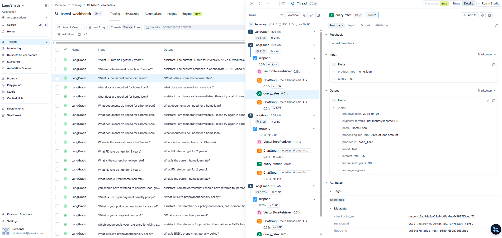
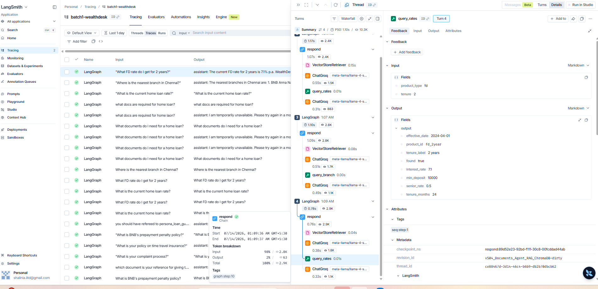
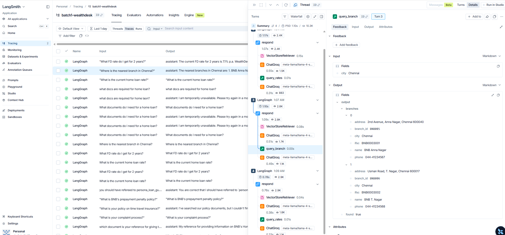
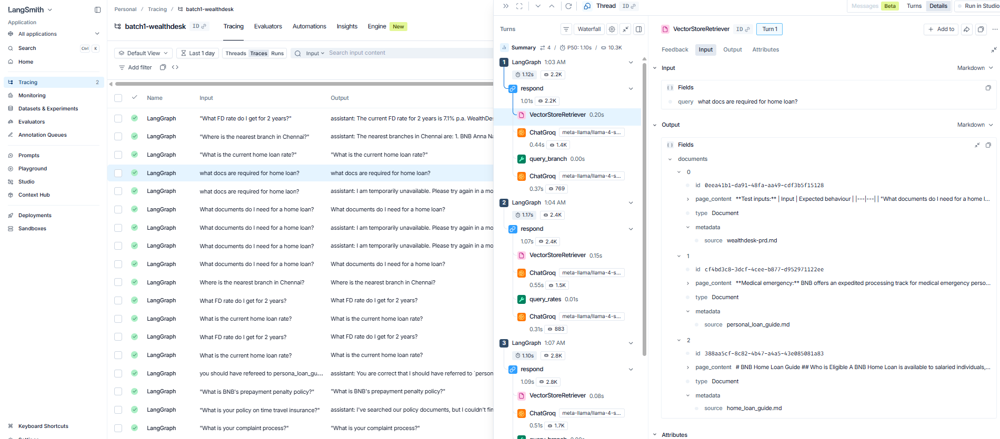
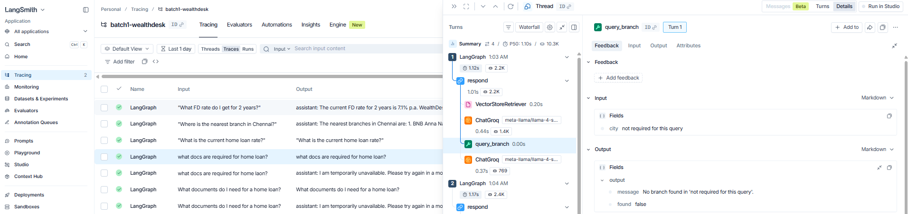
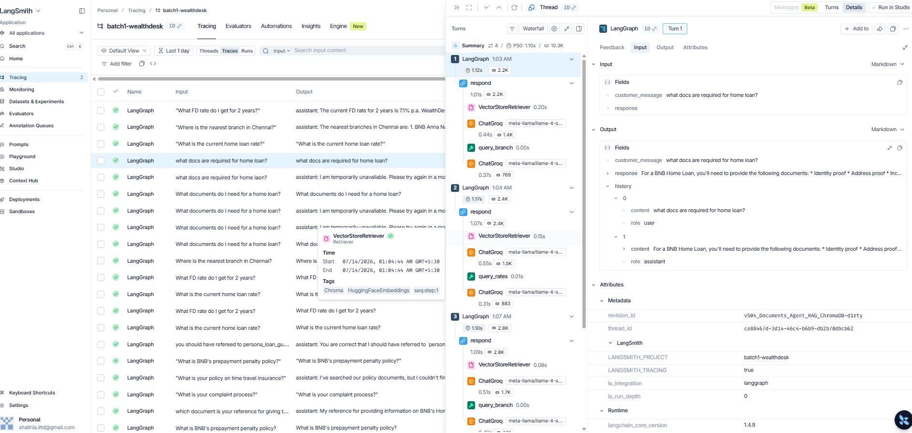

### US-04: Structured Data via SQLite Tool

**As a** bank customer (P1),
**I want** WealthDesk to quote interest rates from BNB's actual rate table rather than from its system prompt
**So that** the rates I receive are always current and consistent with what the bank actually offers.

**As a** bank IT team (P4),
**I want** rate updates to happen in the SQLite database rather than in the agent code
**So that** updating a product rate requires no code change or redeployment.

**Note on why SQLite and not hardcoded:** Hardcoding rates in the system prompt means a rate change requires editing agent code, redeploying, and hoping nothing broke. A SQLite tool call means: update one row in the database, restart the agent. This is the difference between a demo and a maintainable system.

**Acceptance criteria:**
- Given a rate query, when submitted, then agent calls `query_rates(product_type, tenure=None)` which reads from `data/bnb_data.db` and returns current rate, effective date, and minimum deposit or tenure
- Given a branch query, when submitted, then agent calls `query_branch(city)` which returns branch contact information
- Given a query with no matching database row, then tool returns a structured "not found" response (no crash, no hallucinated rate)
- Tool calls are visible as separate spans in the LangGraph execution trace
- Both tools work alongside ChromaDB RAG from US-03 -- agent routes to the correct data source based on query type
- Tool-level correctness (separate from end-to-end answer quality): given `query_rates("home_loan")` called directly with known inputs, the returned dict contains `rate: 8.5`, `effective_date` matching the seeded value, and `tenure_min: 5` -- verifying the tool returns the correct database row, not just that the final answer sounds plausible

**Test inputs:**
| Input | Expected behaviour |
|---|---|"What is the current home loan rate?"
|  | Calls `query_rates("home_loan")`, returns 8.5% with effective date |
Actual

| "What FD rate do I get for 2 years?" | Calls `query_rates("fd", tenure=2)`, returns 7.1% |
Actual

| "Where is the nearest branch in Chennai?" | Calls `query_branch("Chennai")`, returns branch details |

| "What documents do I need for a home loan?" | Uses ChromaDB RAG, not SQLite -- agent routes correctly |
Agents rightly going for vectorDB searching relevanl documents. 

Agent rightly misses tool call for this query.

As per PRD, ChromaDB search is not tool call dependent and so is done , as of now, for every query.This will be refined in further modules.

**Out of scope:** MCP transport (US-06), write operations on the database, customer account lookups.

Tested, query_rates tool is called for  